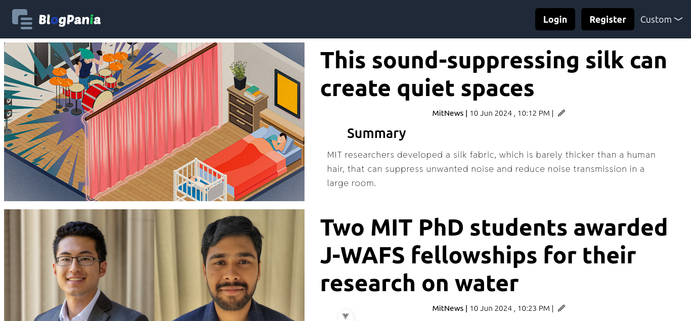
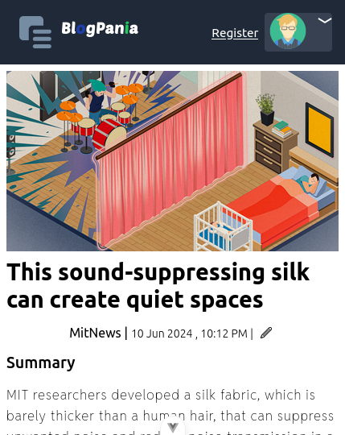

#  Quiz App  

This tech app is a sample **blog** prototype for techreviews. Informatals is a powerful tool to enhance growth around community. Hope you will find this project helpfull

 View live

- Clone the repository
  [ Link repository](https://github.com/BeinRain06/blog-app-tech)
- **run** the terminal command `npm run dev` under both directory : **server** and **vue-project**

  `blog-tech-app/`

##  Features   

- register or login like admin/not
  >
- create post
  >
- edit post
  >
- encrypt token with jwt and private_key/public_key linux
  >
- filer articles by author/theme for admin
  >
- dark/light mode process
-  

- 
     
     
- 

[view code](https://github.com/BeinRain06/blog-app-tech)
